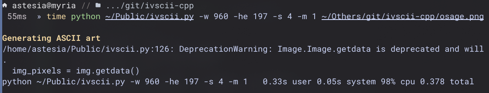
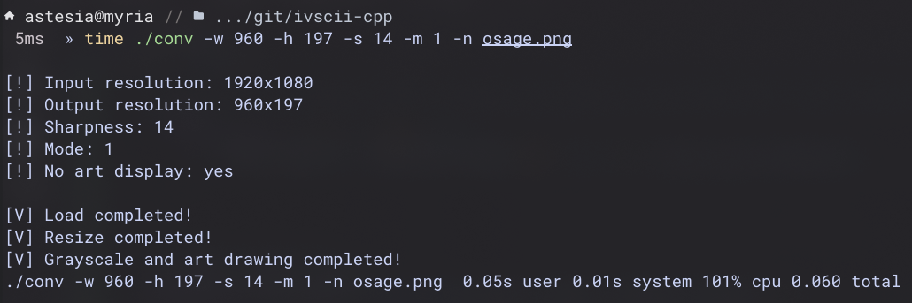
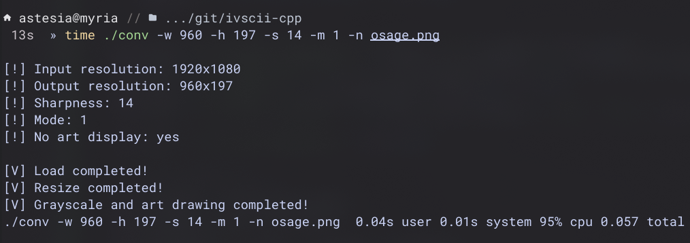

# ivscii-cpp
A highly customizable image and video (soon™) to ASCII art converter.

### Why not improve the original Python version?
Because i left that one many years ago because of how messy the codebase is and also not very customizable. The height of the art depends on the width of art to maintain ratio, which makes the ASCII art smaller or bigger than expected. Its also very slow on low-end devices, taking almost an entire second to render one image. But because Python being an interpreted language, the low performance is unavoidable.

### Bored, then an idea to rewrite.
It was 10 in the morning and i suddenly remembered that ivscii exists, and i want to rewrite it. I researched a little bit on libraries to use on the C++ rewrite and came across [stb](https://github.com/nothings/stb) libraries, which has exactly what i need. And then i decided to go for it. 3 hours of coding and another 4 hours of debugging problems later, i got a working program. And then i decided to compare it against the original version and the performance difference is big. So with that reason, i decided to continue with this project.

### Comparisons
#### Original Python version

Render time: 378ms

#### C++

Compiler options: `-O2`<br>
Render time: 60ms

#### C++ (aggresive optimization)

Compiler options: `-O3 -march=native -pipe -fno-plt`<br>
Render time: 57ms

#### Conclusion
Its almost 6x faster!!!!

### Examples

Render resolution: 960x197<br>
Render time: 68ms (Alacritty)


Render resolution: 960x197

> NOTE: Render time might vary depending on the terminal and the original image size. ivscii-cpp recommends a GPU accelerated terminal, although any terminal will also work but with lower performance

### Installation
```
git clone https://github.com/hithere-at/ivscii-cpp
cd ivscii-cpp
g++ -o ivscii -lm -O3 -march=native -pipe -fno-plt ivscii.cpp utils/classes.cpp utils/conv.cpp
```

Execute the program by running:
```
./ivscii
```

If you need to write the ASCII art to a file, then just redirect stdout to a file like how you would normally do in a shell:
```
./ivscii ... > out.txt
```

### Credits
- [stb libraries](https://github.com/nothings/stb)
